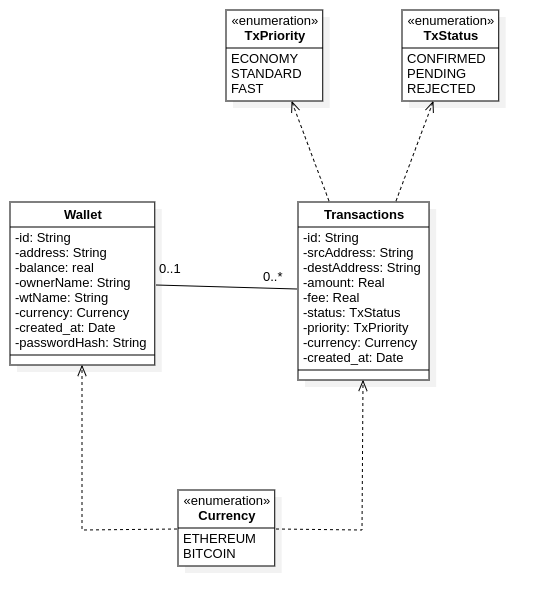

# CryptoMeak

A realistic blockchain wallet and transaction simulator for Bitcoin and Ethereum, featuring mempool analysis, transaction prioritization, and wallet management.

---

## Project Description

CryptoMeak simulates a cryptocurrency wallet system with support for Bitcoin and Ethereum. Users can create wallets, send transactions with different fee priorities, and analyze mempool status and transaction positions. The application is designed for educational and simulation purposes, mimicking real blockchain behaviors such as pending transactions, fee-based prioritization, and wallet security.

---

## Architecture & Design Patterns

### 1. **Layered Architecture**
- **UI Layer:** Command-line interface using the Command pattern for extensible commands (`ui/command/`).
- **Controller Layer:** Orchestrates business logic and mediates between UI and services (`controller/`).
- **Service Layer:** Contains business logic and transaction/wallet operations (`service/impl/`).
- **Repository Layer:** Handles data persistence and retrieval from the database (`repository/`).
- **Model Layer:** Domain entities such as `Wallet`, `Transaction`, and enums (`model/`).

### 2. **Design Patterns Used**
- **Command Pattern:** Each user action is encapsulated as a command class (e.g., `CreateTransactionCommand`, `RegisterWalletCommand`).
- **Factory Pattern:** Factories for fee calculators and utility classes (`factories/`).
- **Builder Pattern:** For constructing complex objects like `Wallet` with optional fields.
- **Singleton Pattern:** `DIContainer` and `Database` ensure single instances for dependency management and DB connection.
- **Dependency Injection:** `DIContainer` wires up controllers, services, and repositories.
- **Strategy Pattern:** Fee calculation logic is encapsulated in strategy classes for each currency.

### 3. **Database**
- Uses PostgreSQL with schema defined in `schema.sql`.
- Tables: `wallets`, `transactions`.
- Enum types for currency, transaction status, and priority.

---

## UML Class Diagram



---

## How to Build and Run

### **Prerequisites**
- Java 11 or higher
- Maven or Gradle (for building)
- PostgreSQL (running and accessible)
- PostgreSQL JDBC Driver (`lib/postgresql-42.7.8.jar`)

### **Database Setup**
1. Create a PostgreSQL database named `CryptoMeak`.
2. Run the SQL in `schema.sql` to set up tables and enums.

### **Build JAR**

**With Maven:**
1. Create a `pom.xml` (if not present) and add dependencies for PostgreSQL.
2. Run:
   ```sh
   mvn clean package
   ```
   The JAR will be in `target/`.

**With Gradle:**
1. Create a `build.gradle` and configure dependencies.
2. Run:
   ```sh
   gradle build
   ```
   The JAR will be in `build/libs/`.

**Or, using `javac` and `jar` directly:**
```sh
cd src
javac -cp "../lib/postgresql-42.7.8.jar" -d ../out $(find . -name "*.java")
cd ../out
jar cvfe ../CryptoMeak.jar Main *
```

### **Run the Application**

```sh
java -cp "CryptoMeak.jar:lib/postgresql-42.7.8.jar" Main
```

---

## Usage

- On startup, follow the CLI prompts.
- Use `help` to see available commands.
- Use `status` to see your session and wallet info.
- Use `exit` to quit.

---

## Security

- Passwords are hashed using SHA-256 before storage.
- Sensitive files and build artifacts are excluded from version control via `.gitignore`.

---

## Extending

- Add new commands by implementing the `Command` interface and registering in `CommandManager`.
- Add new currencies or fee strategies by extending the fee calculator classes and updating factories.

---

## Authors

- [Your Name Here]

---

## License

MIT License (or specify your own)